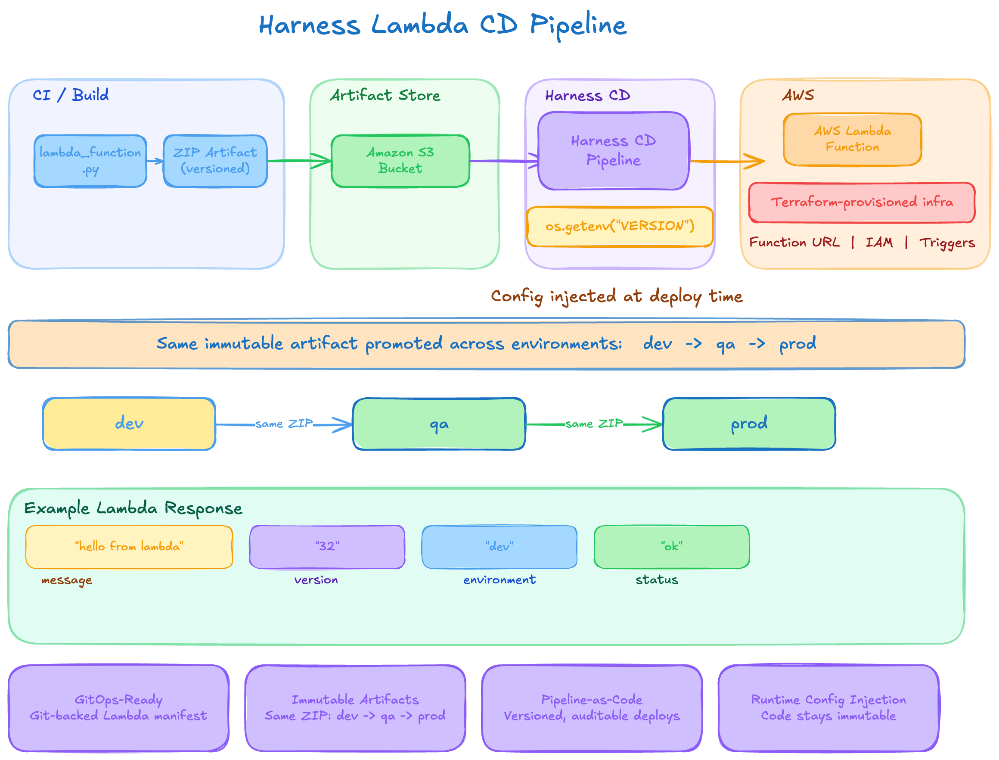

# Harness Lambda CI/CD Lab

Small AWS Lambda + Harness CI/CD lab.

The goal of this repo is to incrementally explore:
- AWS Lambda
- serverless deployment patterns
- immutable artifacts
- runtime configuration injection
- Harness CI/CD orchestration
- cloud-native deployment concepts

## Current Flow



## Current Features

- AWS Lambda Function URL
- Python Lambda runtime
- Harness deployment pipeline
- Git-backed Lambda manifest
- S3 artifact publication
- Runtime environment variable injection
- Dynamic deployment metadata

Example response:

```json
{
  "message": "hello from lambda",
  "version": "32",
  "environment": "dev",
  "status": "ok"
}
```

## Key Concepts

### Immutable Artifacts

The deployable ZIP artifact remains immutable after creation.

```text
dev -> qa -> prod
```

using the SAME artifact.

### Code vs Configuration

Runtime metadata is injected dynamically during deployment:

```python
os.getenv("VERSION")
```

instead of mutating source code during CI.

```text
Code == immutable
Config == dynamically applied during deployment
```

## Future Plans

- HTML/browser rendering
- Request parsing
- Structured logging
- Dependency packaging
- S3/DynamoDB integration
- OCI/containerized Lambda deployments
- Distroless/Chainguard examples